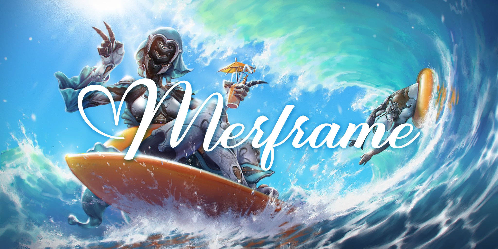
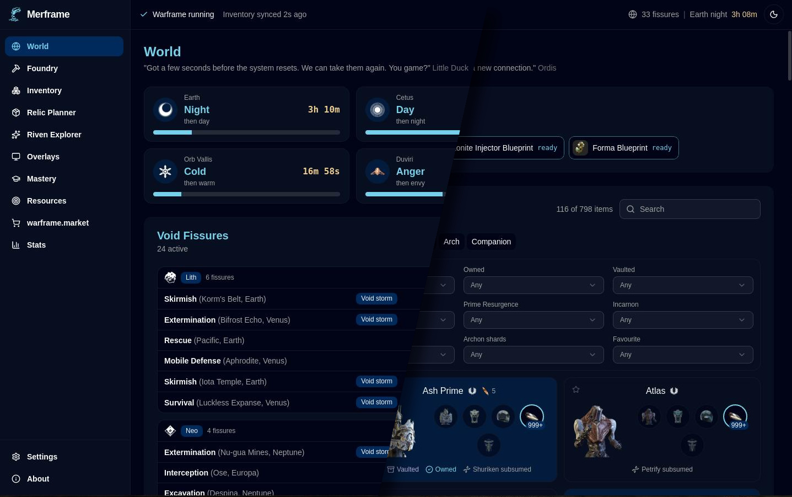

A companion app for Warframe on Linux and Windows.
Displays information about:
 - Inventory
 - Foundry
 - Mastery
 - Relics
 - Rivens
 - warframe.market trading
 - World timers

In-game overlays are available on Windows, X11 and XWayland (This includes Wayland since Proton uses XWayland).

While I have tested the app on Linux and Windows 10, consider the app in Beta until this line disappears from this document. There are currently no automatic updates of the app, patches breaking the app is expected and untested so far.

Bug reports, feature requests, and contributions are welcome.



## Contents

- [Notice](#notice)
- [Running the app](#running-the-app)
- [Running the app from source](#running-the-app-from-source)
- [Privacy](#privacy)
- [How does Merframe work?](#how-does-merframe-work)
- [On memory (Linux)](#on-memory-linux)
- [Credits](#credits)
- [License](#license)

## Notice

Merframe is a fan project and is not affiliated with Digital Extremes.
Warframe and the game artwork under `app/public/game/` are the property of Digital Extremes Ltd. and are used under its content policy for non-commercial fan projects.

## Running the app

Releases are provided as an `.exe` or `.msi` installer (Windows), `.deb`, `.rpm`, Arch `.pkg.tar.zst` packages, and an `AppImage`.

Windows may warn you on install that the application is not known. This is normal, and I'm not willing to pay Microsoft to make it go away.

`AppImage` is the preferred way of running the application on Linux.

On Arch, install the `.pkg.tar.zst` with `pacman -U`, or build it from source with `makepkg` in `packaging/arch/`.

## Running the app from source

Rust workspace under `crates/`, Tauri 2 app with a React front end under `app/`.

You will need:
- `rustup` [(link to rustup)](https://rustup.rs/)
- `pnpm` package manager [(link to pnpm)](https://pnpm.io/installation)

```bash
cd app
pnpm install  # Only on first run or after updates
pnpm tauri dev
```

You can also build a debug binary and run that instead:
```bash
cd app
pnpm tauri build --debug
../target/debug/merframe  # Linux, available after the above command
..\target\debug\merframe.exe  # Windows
```

Running the app from cargo is not supported as that will not start the Vite server.

Diagnostics: `RUST_LOG=merframe_lib=debug,wf_scan=debug pnpm tauri dev`.
App data: `~/.local/share/Merframe/` on Linux, `%APPDATA%\Merframe\` on Windows.
App data holds the SQLite store, the last inventory as `inventory.json.gz`, WFCD image/data cache, settings, and `merframe.log`.

## Privacy

The warframe.market session token (allows acting as you) is stored in plaintext in `market_token` in the app data directory.
It is readable by the user's own processes, just as any other desktop client's session would be.
The token does not contain your password.

Merframe is not sending any of your personal data anywhere outside your PC.
All third party calls are item-specific lookups and carry no information outside your IP (since the request is coming from your PC).

Services Merframe talks to:
- `api.warframe.com`: the public world state, polled every 5 to 10 minutes.
- `api.warframe.market`: orders and riven auctions. Prices work without a login, only listing items needs one.
- `api.yareli.net`: a price cache run by me, so that Merframe does not ask warframe.market for every item separately.
- `raw.githubusercontent.com`: item data from WFCD's `warframe-items`.
- `cdn.warframestat.us`: item images, downloaded once and kept in the app data directory.
- A Discord webhook, only if you set one up under notifications.

## How does Merframe work?

Merframe reads out what the game stores in its own space on your computer - the game's memory.
This is the same approach AlecaFrame uses (via Overwolf) for inventory data.

Merframe goes a bit further and takes this approach for all data: Your current inventory, displayed riven, riven rolls, relic fissure & relic rewards.

DE has so far given the okay for this, but they can not give a clear recommendation for third-party tools.
As with all user tools: Use at your own risk.

## On memory (Linux)

Merframe reads the memory of the running game through `/proc/<pid>/mem` on Linux.
With `kernel.yama.ptrace_scope` at 0 or 1, the default of most distributions, this works without any setup.
Wine and Proton let other processes of the same user read the game.

A system with scope 2 refuses the read unless Merframe holds `CAP_SYS_PTRACE`. Scope 3 refuses it in every case and can only be lowered by a reboot.
In case of a memory permission issue, Merframe reports it as `Reading process <pid> is not permitted`.

You have the following options in case you run into that error at scope 2:

Globally set your system's memory read scope until the next reboot (will also allow other programs to read memory across processes)
```bash
sudo sysctl kernel.yama.ptrace_scope=0
```

Allow it for just Merframe:
```bash
sudo setcap cap_sys_ptrace=ep ./merframe
```

## Credits

Merframe stands on the work of others. Thank you to:
- [AlecaFrame](https://alecaframe.com/), whose feature set Merframe re-creates for Linux and Windows. No AlecaFrame code is used.
- [warframe.market](https://warframe.market) for the trading platform and its public API.
- The [Warframe Community Developers](https://github.com/WFCD): item data from [`warframe-items`](https://github.com/WFCD/warframe-items), the node, sortie and Nightwave tables from [`warframe-worldstate-data`](https://github.com/WFCD/warframe-worldstate-data), the world cycle arithmetic documented by [`warframe-worldstate-parser`](https://github.com/WFCD/warframe-worldstate-parser), and the item images served from `cdn.warframestat.us`.
- The editors of the [Warframe wiki](https://wiki.warframe.com), the source of the Helminth ability table and of the items the exports do not carry.
- Digital Extremes for Warframe, its public worldState and a content policy that lets fan projects exist.
- [ChickenDrawsDogs](https://x.com/ChickenDraws) for their awesome `Dog Days "Hang Loose" Poster` drawing, which is the header image.
- [Tauri](https://tauri.app), [React](https://react.dev), [shadcn/ui](https://ui.shadcn.com), [Radix UI](https://www.radix-ui.com), [Tailwind CSS](https://tailwindcss.com) and [Lucide](https://lucide.dev), which the app is built with.

## License

Merframe is free software under the GNU General Public License, version 3 or (at your option) any later version. The full text is in [`LICENSE`](LICENSE). It comes without any warranty.
The game artwork is excluded, see [Notice](#notice).
